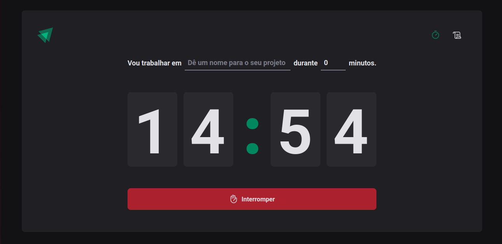
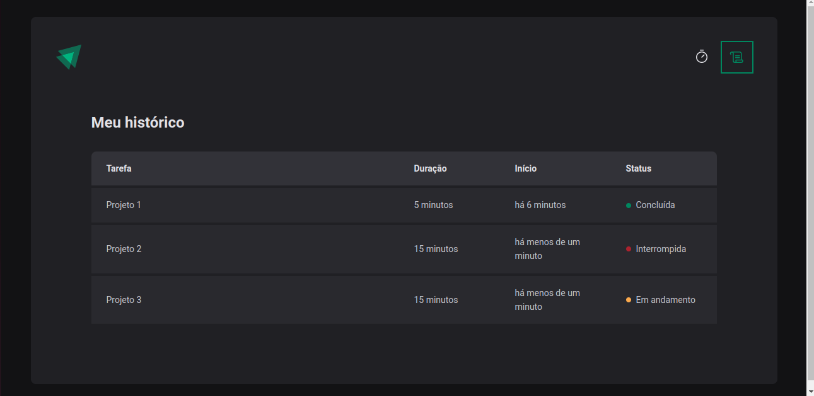

<p align="center">
   
</p>

<p align="center">
   <a href="https://www.linkedin.com/in/luciano-ferreira-b302b61a7/">
      
   </a>

  
</p>

> O projeto consiste em uma aplicação para aplicar a técnica de Pomodoro, o usuário poderá dar um título para sua tarefa e indicar a duração dela, e na aba de históricos o usuário poderá visualizar todas as tarefas concluídas, finalizadas ou em andamento.

## Fotos

<div>
   
   
</div>

## 💻 Tecnologias

Este projeto foi feito utilizando as seguintes tecnologias:

- [React](https://reactjs.org)
- [TypeScript](https://www.typescriptlang.org)
- [Vite](https://vitejs.dev/)
- [Styled Components](https://styled-components.com/)
- [React Hook Form](https://react-hook-form.com/)
- [Zod](https://github.com/colinhacks/zod)
- [Immer](https://immerjs.github.io/immer/)

## 🛠️ Como executar o projeto

Abra o terminal e execute os seguintes comandos

```bash
# Clone o Repositório
$ git clone https://github.com/Ferreira94/ignite-timer.git
```

```bash
# Entre na pasta do projeto e baixe as dependendências
$ npm install

ou

$ yarn install

```

```bash
# Execute o projeto
$ npm run dev

ou

$ yarn dev
```

Acesse <http://localhost:5173> para ver o resultado.

## 🖊️ Autores

<table>
  <tr>
    <td align="center">
      <a href="https://github.com/Ferreira94">
        
        <br />
        <sub>
          <b>Luciano Ferreira</b>
        </sub>
       </a>
       <br />
       <a href="https://www.linkedin.com/in/luciano-ferreira-b302b61a7/" title="Linkedin">@ferreira94</a>
       <br />
       <a href="https://github.com/Ferreira94?tab=repositories" title="Code">💻</a>
    </td>
    <td align="center">
      <a href="https://github.com/Rocketseat">
        
        <br />
        <sub>
          <b>Rocketseat</b>
        </sub>
       </a>
       <br />
       <a href="https://github.com/Rocketseat" title="Linkedin">@Rocketseat</a>
       <br />
       <a href="https://www.linkedin.com/school/rocketseat/" title="Creators">🚀</a>
    </td>
  </tr>
</table>

## 📃 Licença

Este projeto está sob a licença [MIT](./LICENSE).
